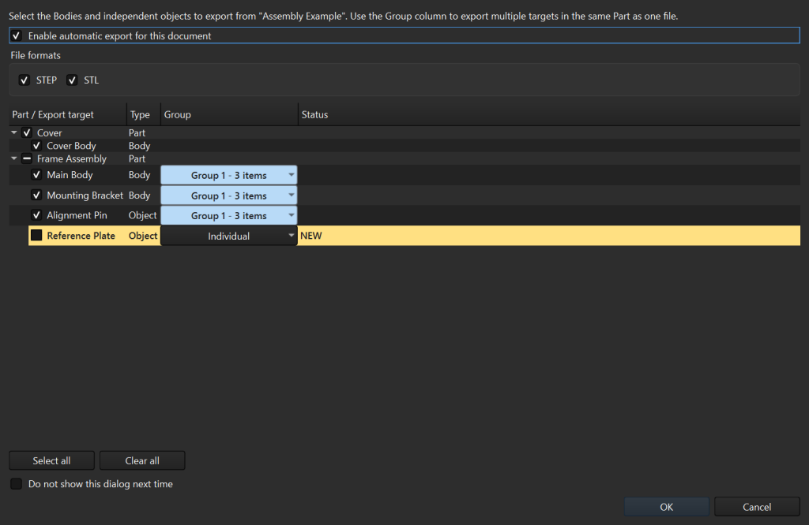

# Auto Body Export

[日本語](README_ja.md) | [User guide](docs/USER_GUIDE.md) | [Contributing](CONTRIBUTING.md)

Automatically export selected FreeCAD Bodies and independent Part objects to
STEP, STL, or both after every successful document save.



## Why use it?

- Choose export targets separately for each `.FCStd` document.
- Combine targets in the same `App::Part` into one output file.
- Keep current filenames stable while archiving replaced files.
- Protect existing files that were not created by the addon.
- Skip unchanged geometry and settings to avoid unnecessary exports.
- Configure output location, filenames, STL quality, history, and UI language.
- Use FreeCAD's own STL export resolution by default, with manual STL quality
  available when needed.

Installation alone does not create files. Both the global setting and the
individual document must be enabled before automatic export starts.

## Requirements

- FreeCAD 1.0 or later
- Python 3.11 or later, as bundled with supported FreeCAD releases
- A document saved to an `.FCStd` path

The automated test suite covers FreeCAD 1.0 and 1.1 on Windows.

## Quick start

1. Install the repository as `Mod/AutoBodyExport` and restart FreeCAD.
2. Open **Edit > Preferences > Auto Body Export**.
3. Enable **Auto Body Export globally** and select STEP, STL, or both.
4. Save an `.FCStd` document, enable automatic export for it, and select the
   targets.
5. Select **OK**. Future successful saves export the remembered selection.

See the [installation and first-export guide](docs/USER_GUIDE.md) for detailed
steps.

## Default output

For `assembly.FCStd`, the default document-adjacent output looks like this:

```text
assembly.FCStd
step/
  assembly_Frame_Main Body.step
  old_versions/
    v0/
      assembly_Frame_Main Body_v0.step
stl/
  assembly_Frame_Main Body.stl
```

The latest export keeps its normal filename. Replaced and obsolete managed
files move to `old_versions/vN/`. Files not created by Auto Body Export are
never overwritten.

## Documentation

- [English user guide](docs/USER_GUIDE.md)
- [日本語ユーザーガイド](docs/USER_GUIDE_ja.md)
- [Contributing](CONTRIBUTING.md)
- [Security policy](SECURITY.md)
- [Changelog](CHANGELOG.md)

This project was developed with assistance from AI tools. Final decisions and
verification are performed by the maintainer.

## License

[MIT](LICENSE)
