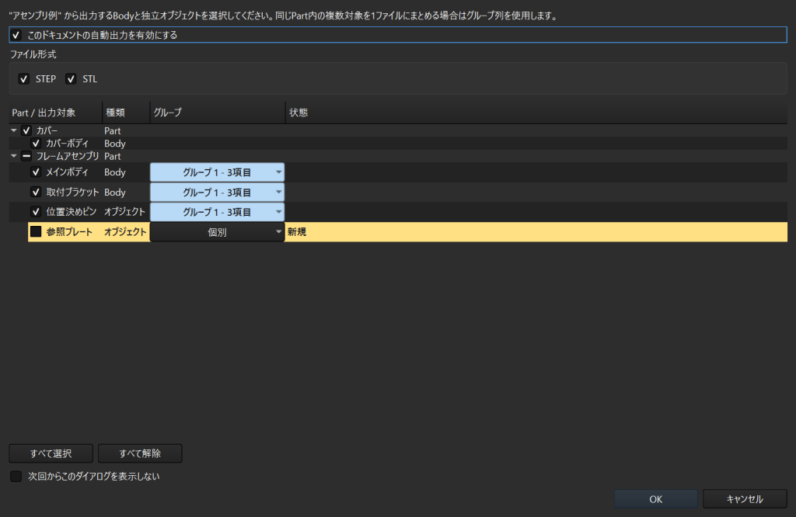

# Auto Body Export

[English](README.md) | [ユーザーガイド](docs/USER_GUIDE_ja.md) | [開発への参加](CONTRIBUTING.md)

FreeCADドキュメントの保存成功後に、選択したBodyとPart内の独立オブジェクトを
STEP、STL、または両方へ自動出力します。



## このアドオンでできること

- `.FCStd` ドキュメントごとに出力対象を選択
- 同じ `App::Part` 内の複数対象を1つのファイルへ出力
- 最新ファイルの名前を維持しながら、置換前のファイルを履歴保存
- アドオンが作成していない既存ファイルを保護
- 形状と設定が未変更の場合は不要な再出力を省略
- 出力先、ファイル名、STL品質、履歴、UI言語を設定
- 既定ではFreeCAD本体のSTL出力解像度を使用し、必要な場合だけSTL品質を手動設定

インストールしただけではファイルを作成しません。自動出力を開始するには、
全体設定と各ドキュメント設定の両方を有効にする必要があります。

## 動作要件

- FreeCAD 1.0以降
- 対応するFreeCADに同梱されるPython 3.11以降
- `.FCStd` のパスへ保存済みのドキュメント

自動テストはWindows上のFreeCAD 1.0と1.1を対象としています。

## クイックスタート

1. このリポジトリを `Mod/AutoBodyExport` として配置し、FreeCADを再起動します。
2. **Edit > Preferences > Auto Body Export** を開きます。
3. **Auto Body Exportを全体で有効にする** を有効にし、STEP、STL、または
   両方を選択します。
4. `.FCStd` ドキュメントを保存し、そのドキュメントの自動出力を有効にして
   出力対象を選択します。
5. **OK** を選択します。以後、保存成功時に記憶された対象を出力します。

詳しい手順は[インストールと初回出力](docs/USER_GUIDE_ja.md)を参照してください。

## 既定の出力

`assembly.FCStd` の隣へ出力する場合、既定では次の構成になります。

```text
assembly.FCStd
step/
  assembly_Frame_Main Body.step
  old_versions/
    v0/
      assembly_Frame_Main Body_v0.step
stl/
  assembly_Frame_Main Body.stl
```

最新ファイルは通常名を維持します。既定では、置換前と不要になった管理ファイルは
`old_versions/vN/` へ移動します。Auto Body Exportが作成していないファイルを
上書きすることはありません。

各ドキュメントで全体設定とは別の出力先を指定できます。`{document_dir}/export`
のように `{document_dir}` を使うと、作業中の `.FCStd` の隣へ出力できます。
親ディレクトリ配下へ出力する場合は `{document_parent_dir}/export` または
`{document_dir}/../export` を指定できます。

履歴も `{document_dir}/export_history` のように1つの保存先を指定できます。
その配下に `step/vN/` と `stl/vN/` を自動作成します。

## ドキュメント

- [日本語ユーザーガイド](docs/USER_GUIDE_ja.md)
- [English user guide](docs/USER_GUIDE.md)
- [開発への参加](CONTRIBUTING.md)
- [Security policy](SECURITY.md)
- [変更履歴](CHANGELOG.md)

本プロジェクトではAIツールを開発支援に利用しています。最終的な判断と検証は
maintainerが行っています。

## ライセンス

[MIT](LICENSE)
