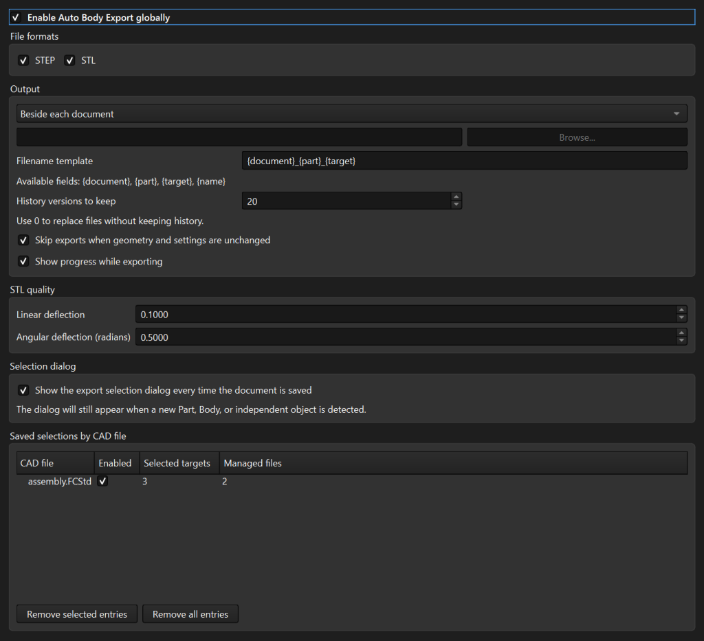

# Auto Body Export User Guide

[README](../README.md) | [日本語](USER_GUIDE_ja.md)

Auto Body Export writes selected FreeCAD Bodies and independent Part objects to
STEP, STL, or both after a document is saved successfully. Selections, groups,
and enable state are remembered separately for each `.FCStd` file.

## Contents

- [Installation](#installation)
- [First export](#first-export)
- [Selection and grouping](#selection-and-grouping)
- [Output and history](#output-and-history)
- [Filename template](#filename-template)
- [Preferences](#preferences)
- [Troubleshooting](#troubleshooting)
- [Safety](#safety)

## Installation

### Requirements

- FreeCAD 1.0 or later
- Python 3.11 or later, as bundled with supported FreeCAD releases
- A document saved to an `.FCStd` path

### Manual installation

1. Open the FreeCAD Python console and run:

   ```python
   FreeCAD.getUserAppDataDir()
   ```

2. Close FreeCAD.
3. Create or open the `Mod` directory below the returned path.
4. Clone or extract this repository into a directory named `AutoBodyExport`.
5. Confirm that `Init.py`, `InitGui.py`, and `package.xml` are directly inside
   that directory.
6. Restart FreeCAD.

Example for a typical Windows installation:

```powershell
git clone https://github.com/ProProPrin/FreeCAD-AutoBodyExport.git `
  "$env:APPDATA\FreeCAD\Mod\AutoBodyExport"
```

## First export

1. Open **Edit > Preferences > Auto Body Export**.
2. Enable **Auto Body Export globally**.
3. Keep STEP selected, enable STL if needed, then apply the preferences.
4. Open or create a document and save it to an `.FCStd` path.
5. In the selection dialog:
   - keep **Enable automatic export for this document** selected;
   - select the Bodies and independent objects to export;
   - choose STEP, STL, or both;
   - optionally group targets from the same Part.
6. Select **OK**.


The addon is disabled globally by default. Each document also requires its own
opt-in. Selecting **Cancel** skips export for that save without discarding the
remembered configuration.

## Selection and grouping

### Supported targets

Auto Body Export recognizes:

- `PartDesign::Body` objects, including Bodies outside an `App::Part`;
- shape-bearing objects directly inside an `App::Part`;
- nested Parts, with placements applied to exported geometry.

Features already contained by a Body are exported with that Body and are not
listed as independent targets. An independent object must have a Shape and be
directly inside an `App::Part`.

### Selecting targets

- Select a Body or object to export it.
- Select a Part row to select or clear all targets below that Part.
- Use **Select all** or **Clear all** for the complete document.
- New Parts, Bodies, and independent objects are highlighted as **NEW**.

The saved selection is associated with the normalized `.FCStd` path. Renaming
or moving the document creates a separate saved entry.

### Grouping targets

Use the **Group** column to place two or more selected targets in one output
file. Grouping is limited to targets with the same direct parent `App::Part`.
Group controls are hidden when a Part has fewer than two eligible targets.

Group membership is shown with a shared label and color. Selecting or clearing
one group member changes the selection of every member. A group is exported
only when every member still exists and has a non-empty Shape.

For a group that contains Bodies, the filename target component uses the Body
labels. Object-only groups use `Group` plus a stable collision-avoidance suffix.

## Output and history

### Output beside each document

This is the default output mode. For `assembly.FCStd`, STEP and STL files are
stored in sibling directories:

```text
assembly.FCStd
step/
  assembly_Frame_Main Body.step
  old_versions/
    v0/
      assembly_Frame_Main Body_v0.step
stl/
  assembly_Frame_Main Body.stl
```

STEP history is kept under `step/old_versions/`; STL history is kept under
`stl/old_versions/`.

### Custom output directory

When **Custom directory** is selected, each document receives a subdirectory
such as:

```text
<custom directory>/
  assembly_a1b2c3d4/
    step/
    stl/
```

The suffix is derived from the source document directory. Same-named documents
from different projects therefore receive different output directories.

### Replacement and history

- The latest export always keeps its normal filename.
- Before replacement, the previous managed file moves to the next
  `old_versions/vN/` directory as `filename_vN.ext`.
- All files replaced in one format during the same run share the same version
  number.
- History is pruned to the configured limit. A limit of `0` replaces files
  without keeping history.

If a target is deselected, renamed, deleted, regrouped, moved to another output
root, or its format is disabled, the obsolete managed file is retired only
after the complete export run succeeds.

### Collision and failure protection

Auto Body Export records the files it creates. If the requested output path is
occupied by an unmanaged file, that file is preserved and the new export
receives a stable hash suffix.

Each export is first written to a temporary file. The current managed file is
archived only after the temporary export succeeds. If final replacement fails,
the previous current file is restored.

### Unchanged exports

With unchanged-export skipping enabled, the addon compares the geometry and
relevant output settings with the previous successful run. Existing output is
reused when they match. STL mesh settings are included in the STL comparison;
when FreeCAD STL settings are enabled, the current FreeCAD mesh export
deviation is used.

## Filename template

The default template is:

```text
{document}_{part}_{target}
```

| Field | Value |
| --- | --- |
| `{document}` | `.FCStd` filename without the extension |
| `{part}` | Direct parent Part label, or empty when no Part exists |
| `{target}` | Target label or grouped Body labels |
| `{name}` | Internal FreeCAD object name |

A template must contain at least one supported field. Format specifications and
conversions are not supported. Invalid templates return to the default.

Invalid filesystem characters and Windows reserved names are sanitized.
Repeated separators are collapsed. Long names and duplicate rendered names
receive stable hash suffixes.

## Preferences

Open **Edit > Preferences > Auto Body Export**.



| Setting | Default | Effect |
| --- | --- | --- |
| Interface language | Follow FreeCAD | Use Japanese for a Japanese FreeCAD UI and English otherwise, or force English/Japanese |
| Enable globally | Off | Master switch required before any automatic export |
| STEP | On | Produce STEP output |
| STL | Off | Produce STL output |
| Output mode | Beside each document | Use folders beside the document or under a selected directory |
| Filename template | `{document}_{part}_{target}` | Build the current output filename |
| History versions | `20` | Maximum `old_versions/vN/` directories retained per format |
| Skip unchanged exports | On | Reuse existing output when geometry and settings match |
| Show progress | On | Display export progress for GUI runs |
| Use FreeCAD STL export settings | On | Use FreeCAD's mesh export deviation for STL output |
| STL linear deflection | `0.1` | Manual STL mesh linear precision when FreeCAD settings are off |
| STL angular deflection | `0.5` radians | Manual STL mesh angular precision when FreeCAD settings are off |
| Show selection dialog every save | On | Prompt on every successful save |

At least one output format is required. If both format checkboxes are cleared,
STEP is restored when preferences are saved.

If the per-save dialog setting is disabled, the dialog still opens when a new
Part, Body, or independent object is detected.

### Saved selections by CAD file

The table shows each known CAD path, its document-level enable state, selected
target count, and managed-file count.

- Change the **Enabled** checkbox to enable or disable a known document.
- **Remove selected entries** forgets the selected saved configurations.
- **Remove all entries** forgets every saved configuration after confirmation.

Removing a saved entry does not delete export files. The next save treats the
document as a new configuration and opens the selection dialog.

## Troubleshooting

### No export is produced

Check all of the following:

1. The document has an `.FCStd` path and the save completed successfully.
2. **Enable Auto Body Export globally** is selected.
3. Automatic export is enabled for the document.
4. At least one target and one format are selected.
5. FreeCAD's Report view does not show an export error.

### The Preferences page is missing

Confirm that the installed `AutoBodyExport` directory is inside the `Mod`
directory returned by `FreeCAD.getUserAppDataDir()`. Its top level must contain
`Init.py`, `InitGui.py`, and `package.xml`. Restart FreeCAD after correcting the
installation.

### A target is missing

- A Body can be inside or outside an `App::Part`.
- An independent object must have a Shape and be directly inside an
  `App::Part`.
- Features inside a Body are intentionally represented by the Body.

### A filename has a hash suffix

The original name collided with another rendered name, exceeded the safe
length, or was already occupied by a file not managed by the addon. The suffix
is stable for the same target identity.

### A group is not exported

Open FreeCAD's Report view. One or more group members may have been deleted,
may have an empty Shape, or may no longer belong to the same direct parent
Part. Group export is all-or-nothing.

### The dialog appears even though it was disabled

This is expected when a new Part, Body, or independent object is detected. The
prompt prevents new exportable geometry from being silently ignored.

## Safety

- Global and document-level opt-in are both required.
- Only files recorded as generated by this addon are archived or retired.
- Managed paths must be direct STEP/STL outputs below a recorded output root.
- Temporary output and rollback-safe replacement protect the current file.
- Obsolete files are retired only after a complete successful export run.
- Failures are reported in FreeCAD's Report view and, in GUI mode, in a warning
  dialog.

Keep independent backups of important CAD data. Automatic export and history
retention are not a replacement for project backups.

Report suspected vulnerabilities privately according to the
[security policy](../SECURITY.md).
