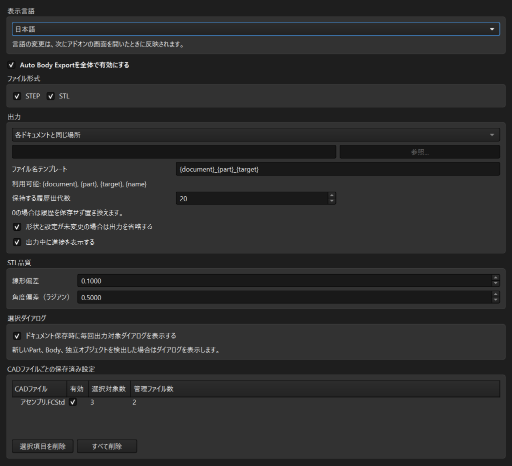

# Auto Body Export ユーザーガイド

[README](../README_ja.md) | [English](USER_GUIDE.md)

Auto Body Exportは、FreeCADドキュメントの保存成功後に、選択したBodyとPart内の
独立オブジェクトをSTEP、STL、または両方へ出力します。選択対象、グループ、
有効状態は `.FCStd` ファイルごとに記憶されます。

## 目次

- [インストール](#インストール)
- [初回出力](#初回出力)
- [対象選択とグループ化](#対象選択とグループ化)
- [出力と履歴](#出力と履歴)
- [ファイル名テンプレート](#ファイル名テンプレート)
- [設定](#設定)
- [トラブルシューティング](#トラブルシューティング)
- [安全設計](#安全設計)

## インストール

### 動作要件

- FreeCAD 1.0以降
- 対応するFreeCADに同梱されるPython 3.11以降
- `.FCStd` のパスへ保存済みのドキュメント

### 手動インストール

1. FreeCADのPython consoleを開き、次を実行します。

   ```python
   FreeCAD.getUserAppDataDir()
   ```

2. FreeCADを終了します。
3. 表示されたパス内の `Mod` ディレクトリを作成するか開きます。
4. このリポジトリを `AutoBodyExport` という名前のディレクトリへcloneまたは
   展開します。
5. そのディレクトリ直下に `Init.py`、`InitGui.py`、`package.xml` があることを
   確認します。
6. FreeCADを再起動します。

一般的なWindows環境の例:

```powershell
git clone https://github.com/ProProPrin/FreeCAD-AutoBodyExport.git `
  "$env:APPDATA\FreeCAD\Mod\AutoBodyExport"
```

## 初回出力

1. **Edit > Preferences > Auto Body Export** を開きます。
2. **Auto Body Exportを全体で有効にする** を有効にします。
3. STEPを選択したままにし、必要ならSTLも有効にして設定を適用します。
4. ドキュメントを開くか作成し、`.FCStd` のパスへ保存します。
5. 選択ダイアログで次を設定します。
   - **このドキュメントの自動出力を有効にする** を選択したままにする
   - 出力するBodyと独立オブジェクトを選択する
   - STEP、STL、または両方を選択する
   - 必要なら同じPart内の対象をグループ化する
6. **OK** を選択します。


初期状態ではアドオン全体が無効です。各ドキュメントでも個別に有効化する
必要があります。**キャンセル** を選択すると、その保存時の出力だけを中止し、
記憶済みの設定は破棄しません。

## 対象選択とグループ化

### 対応する対象

Auto Body Exportは次の対象を認識します。

- `App::Part` の外にあるものを含む `PartDesign::Body`
- `App::Part` 直下にあり、Shapeを持つオブジェクト
- 配置を出力形状へ反映した入れ子のPart

Body内に含まれるFeatureはBodyと一緒に出力されるため、独立した対象としては
表示されません。独立オブジェクトはShapeを持ち、`App::Part` 直下にある必要が
あります。

### 対象の選択

- Bodyまたはオブジェクトを選択すると、その対象を出力します。
- Part行を選択すると、そのPart以下の対象をまとめて選択・解除できます。
- ドキュメント全体には **すべて選択** と **すべて解除** を使用します。
- 新しく検出されたPart、Body、独立オブジェクトは **新規** として強調表示されます。

保存設定は正規化された `.FCStd` パスに関連付けられます。ドキュメントを改名・
移動すると、別の保存設定として扱われます。

### 対象のグループ化

**グループ** 列を使うと、選択した2つ以上の対象を1つの出力ファイルへ
まとめられます。グループ化できるのは、同じ直接親 `App::Part` を持つ対象だけ
です。対象が2つ未満のPartではグループ操作を表示しません。

同じグループには共通のラベルと色を表示します。1つのメンバーを選択・解除すると、
すべてのメンバーへ反映されます。全メンバーが存在し、空でないShapeを持つ場合に
だけグループを出力します。

Bodyを含むグループでは、BodyのLabelをファイル名のtarget部分に使用します。
独立オブジェクトだけのグループでは `Group` と安定したhash suffix（接尾辞）を
使用します。

## 出力と履歴

### 各ドキュメントの隣へ出力

既定の出力モードです。`assembly.FCStd` のSTEPとSTLは、隣接するディレクトリへ
保存されます。

```text
assembly.FCStd
step/
  assembly_Frame_Main Body.step
  old_versions/
    v0/
      assembly_Frame_Main Body_v0.step
stl/
  assembly_Frame_Main Body.stl
```

STEP履歴は `step/old_versions/`、STL履歴は `stl/old_versions/` に保存します。

### 指定したディレクトリへ出力

**指定したディレクトリ** を選択すると、ドキュメントごとに次のような
サブディレクトリを作成します。

```text
<指定したディレクトリ>/
  assembly_a1b2c3d4/
    step/
    stl/
```

hash suffixは元ドキュメントのディレクトリから生成します。そのため、異なる
プロジェクトにある同名ドキュメントは別々の出力先を使用します。

### 置換と履歴

- 最新の出力は常に通常のファイル名を維持します。
- 置換前の管理ファイルは、次の `old_versions/vN/` へ
  `filename_vN.ext` として移動します。
- 同じ実行で置換される同一形式のファイルは、同じ世代番号を共有します。
- 履歴は設定された上限まで整理されます。`0` の場合は履歴を残さず置換します。

対象の選択解除、改名、削除、再グループ化、出力先の変更、形式の無効化で
不要になった管理ファイルは、出力処理全体が成功した後にだけ履歴へ移動します。

### 衝突と失敗からの保護

Auto Body Exportは自身が作成したファイルを記録します。要求された出力先に
管理外ファイルがある場合、そのファイルを維持し、新しい出力へ安定したhash
suffixを追加します。

各出力は最初に一時ファイルへ書き込みます。一時出力が成功した後にだけ現在の
管理ファイルを履歴へ移動します。最終的な置換に失敗した場合は、以前の最新
ファイルを復元します。

### 未変更時の出力省略

未変更時の省略が有効な場合、前回成功時の形状と関連する出力設定を比較します。
一致し、出力ファイルが存在する場合は再利用します。STLではメッシュ設定も比較対象です。
FreeCADのSTL出力設定を使用する場合は、現在のFreeCAD側のメッシュ出力偏差を使用します。

## ファイル名テンプレート

既定のテンプレート:

```text
{document}_{part}_{target}
```

| フィールド | 内容 |
| --- | --- |
| `{document}` | 拡張子を除いた `.FCStd` ファイル名 |
| `{part}` | 直接親PartのLabel。Partがない場合は空 |
| `{target}` | 対象のLabelまたはグループ化したBodyのLabel |
| `{name}` | FreeCAD内部のオブジェクト名 |

テンプレートには、対応するフィールドを1つ以上含める必要があります。format
specification（書式指定）とconversion（変換指定）には対応していません。
無効なテンプレートは既定値へ戻ります。

ファイルシステムで使用できない文字とWindows予約名は自動的に置換します。
重複した区切り記号は整理します。長すぎる名前と変換後に重複した名前には、
安定したhash suffix（接尾辞）を追加します。

## 設定

**Edit > Preferences > Auto Body Export** を開きます。



| 設定 | 既定値 | 効果 |
| --- | --- | --- |
| 表示言語 | FreeCADの設定に従う | FreeCADが日本語なら日本語、それ以外は英語。英語・日本語の固定も可能 |
| 全体で有効化 | 無効 | 自動出力全体の主スイッチ |
| STEP | 有効 | STEPを出力 |
| STL | 無効 | STLを出力 |
| 出力モード | 各ドキュメントと同じ場所 | ドキュメントの隣または指定したディレクトリ以下へ出力 |
| ファイル名テンプレート | `{document}_{part}_{target}` | 最新出力のファイル名を生成 |
| 保持する履歴世代数 | `20` | 各形式で保持する `old_versions/vN/` の最大数 |
| 未変更時の出力省略 | 有効 | 形状と設定が一致する場合に既存出力を再利用 |
| 進捗表示 | 有効 | GUI実行時に出力進捗を表示 |
| FreeCADのSTL出力設定を使用 | 有効 | FreeCAD側のメッシュ出力偏差でSTLを出力 |
| STL線形偏差 | `0.1` | FreeCAD設定を使わない場合の手動STL線形精度 |
| STL角度偏差 | `0.5` rad | FreeCAD設定を使わない場合の手動STL角度精度 |
| 保存ごとに選択ダイアログを表示 | 有効 | 保存成功後に毎回確認 |

出力形式は1つ以上必要です。両方を解除した場合、設定保存時にSTEPが再び有効に
なります。

保存ごとのダイアログを無効にしても、新しいPart、Body、独立オブジェクトを
検出した場合はダイアログを表示します。

### CADファイルごとの保存済み設定

一覧には既知のCADパス、ドキュメント単位の有効状態、選択対象数、管理ファイル数を
表示します。

- **有効** checkboxで既知のドキュメントを有効・無効にできます。
- **選択項目を削除** は選択した保存設定を忘れます。
- **すべて削除** は確認後にすべての保存設定を忘れます。

保存設定を削除しても出力ファイルは削除しません。次回保存時は新しい設定として
扱い、選択ダイアログを表示します。

## トラブルシューティング

### ファイルが出力されない

次をすべて確認してください。

1. ドキュメントに `.FCStd` パスがあり、保存が正常に完了している。
2. **Auto Body Exportを全体で有効にする** が選択されている。
3. そのドキュメントの自動出力が有効になっている。
4. 対象と出力形式が1つ以上選択されている。
5. FreeCADのReport viewに出力エラーがない。

### Preferences pageが表示されない

インストールした `AutoBodyExport` ディレクトリが
`FreeCAD.getUserAppDataDir()` の示す場所にある `Mod` 内か確認してください。
直下に `Init.py`、`InitGui.py`、`package.xml` が必要です。配置を修正した後は
FreeCADを再起動してください。

### 対象が表示されない

- Bodyは `App::Part` の内外どちらでも対象になります。
- 独立オブジェクトはShapeを持ち、`App::Part` 直下にある必要があります。
- Body内のFeatureは意図的にBodyとして表示されます。

### ファイル名にhash suffixが付く

元の名前が別の変換結果と衝突した、安全な長さを超えた、または同名の管理外
ファイルが存在したことを示します。同じ対象の識別情報には安定したsuffixを
使用します。

### グループが出力されない

FreeCADのReport viewを確認してください。メンバーが削除された、Shapeが空、
または同じ直接親Partに属さなくなった可能性があります。すべてのメンバーが
有効な場合にだけグループ全体を出力します。

### 無効にしたダイアログが表示される

新しいPart、Body、独立オブジェクトを検出した場合は意図的に表示します。新しい
出力可能形状が気付かれないまま無視されることを防ぎます。

## 安全設計

- 全体とドキュメントの両方で明示的な有効化が必要
- このアドオンが生成したと記録しているファイルだけを履歴移動・整理
- 管理対象パスを記録済み出力先直下のSTEP/STLへ限定
- 一時出力とrollback可能な置換で現在のファイルを保護
- 不要ファイルの履歴移動は完全な出力成功後にだけ実行
- 失敗はFreeCADのReport viewと、GUIでは警告dialogへ表示

重要なCADデータは独立してbackupしてください。自動出力と履歴管理は
プロジェクトbackupの代わりにはなりません。

脆弱性の疑いは[Security policy](../SECURITY.md)に従って非公開で報告してください。
